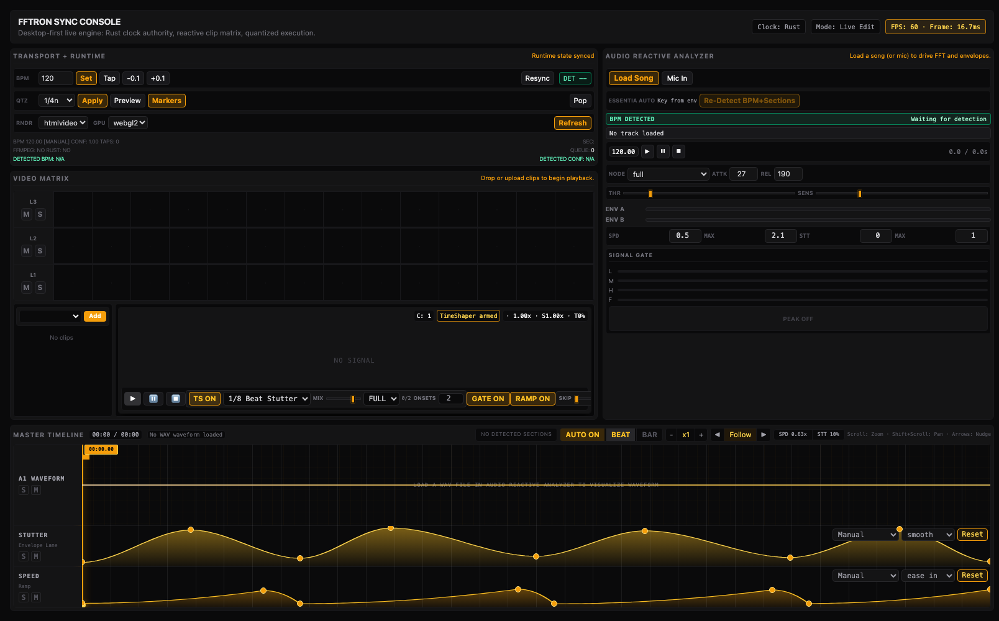

# Hot Deck VJ Operator Guide

This guide explains how the current implementation pieces fit together and what is already live in the browser UI.

## Use the repository sample media

For browser verification and local demos, use the repo sample folder:

- Videos: `test videos-audio/videos/*.mp4`
- Audio: `test videos-audio/audio/04 - The Way You Love Me (Heartbreaking Love Demons).wav`

The browser cannot read that folder automatically without a user file-picker action, so use the file pickers:

1. **Video Matrix → Add** to select one or more MP4 files from `test videos-audio/videos/`.
2. **Audio Reactive Analyzer → Load Song** to select the WAV or MP3 from `test videos-audio/audio/`.
3. Press the video and audio play buttons.

## What the video matrix does

The Video Matrix is a deck/slot selector, not a layered compositor.

- Each cell is a clip slot.
- L1/L2/L3 are lanes used for organization, muting, and soloing.
- Only active, unmuted/non-excluded clips are eligible for cycling.
- The output remains one visible deck/clip in steady state.
- Future transition work may briefly show two decks, but this is still not a general alpha-layer compositor.

## When clips cycle to the next one

The app no longer switches simply every beat by default. It now repeats the current clip until the onset counter reaches the configured target.

The current rule is:

1. Audio FFT/envelope data from the Audio Reactive Analyzer creates an onset when `Env A` crosses the threshold.
2. The current clip keeps repeating while the onset counter is below **Onsets**.
3. When the counter reaches **Onsets**, the next active matrix clip is selected on the next quantized `Beat` or `Bar` boundary.
4. The counter resets after a switch.

Controls:

- **GATE ON**: count real audio onsets via the envelope threshold.
- **GATE OFF**: quantized boundaries count instead, useful for testing without audio.
- **Onsets**: number of counted onsets before the next clip switch.
- **Skip**: probability that an eligible switch is bypassed.

## How TimeShaper presets affect videos

The TimeShaper controls remap the current video clip's source time. They do not choose the next clip by themselves.

- **Preset** chooses the timing curve:
  - `1/8 Beat Stutter`
  - `Backspin Scratch`
  - `Reverse Slice`
  - `Tape Stop`
  - `Half-Time Drag`
- **Mix** controls dry/wet strength. `0` is normal playback; `1` is full remapping.
- **Band** chooses which audio band drives the trigger sensitivity.
- **TS ON/OFF** bypasses source-time remapping.

TimeShaper is applied inside the selected clip. Clip cycling is separately controlled by the onset counter and quantized boundary.

## What the bottom curves do

The bottom timeline curves are still active and are factored in separately from TimeShaper:

- **STUTTER** lane drives the normalized stutter automation value.
- **SPEED** lane drives the normalized speed automation value.
- The deck playback loop uses those values for speed ramp and stutter intensity.
- TimeShaper then adds source-time remapping on top when enabled.

So the stack is:

1. Matrix chooses the current clip.
2. Bottom curves set speed/stutter automation values.
3. Audio analyzer supplies FFT/envelope/onsets.
4. TimeShaper preset remaps source time for the current clip.
5. Onset counter decides when the next clip is allowed to cycle.
6. FPS HUD reports actual browser frame cadence.

## Frame-rate HUD

The top HUD shows live browser `requestAnimationFrame` cadence:

- `FPS` is measured over rolling samples.
- `Frame` is the most recent measured frame budget in milliseconds.

This is a UI/browser measurement. It does not by itself prove future WebGPU hot-deck one-frame switching; that still depends on the hot-deck telemetry contracts added under `src/lib/runtime/decks/` and `src/lib/rendering/webgpu/`.

## Current verified browser smoke

The browser smoke check verified the live UI path and then the operator workflow was documented against the repo sample folder:

- video file upload path works in the Video Matrix
- audio file upload path works in the Audio Reactive Analyzer
- repo sample media location is documented for manual browser selection
- TimeShaper preset controls render in UI
- `Tape Stop` changes video playback rate during browser playback
- FPS HUD rendered around 60 FPS / ~16.6ms in Chrome

## Known limitations

- The app does not auto-import `test videos-audio/` files because browsers require user selection for local files.
- The current TimeShaper UI path is HTMLVideo-backed live behavior; the WebGPU hot-deck contracts and skeleton are present but not a complete production compositor.
- Bottom curve lanes and TimeShaper are both applied, but they are currently separate controls rather than a single unified curve editor.
